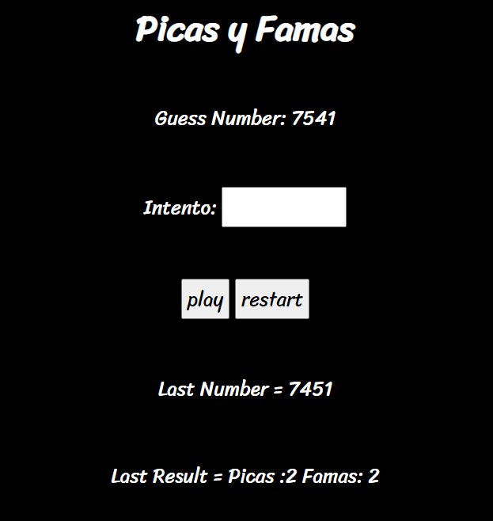

# Picas y Famas

Es un pequeño juego desplegado en una pagina web. Se intenta adivinar un numero, dando como conocimiento si las cifras se encuentran o no y si están en la posición correcta

Heroku : https://spring-picas-y-famas.herokuapp.com/

## Autor

* **J. Eduardo Arias Barrera** - *Initial work* - [AriasAEnima](https://github.com/AriasAEnima)


## Rendimiento LOC/h

Fueron aprox 150 lineas y una duracion entre consultar y escritura de 8 hr.

LOC=18 LOC/h

### Se Utilizó:

Java JDK 1.8, Maven y Git instalados.

* [JAVA JDK 8](http://www.oracle.com/technetwork/java/javase/overview/index.html) - Version de Java
* [Maven](https://maven.apache.org/) - Maven
* Spring Web  (Dependencia)
* Thymeleaf (Dependencia)

## Para empezar

Se debe ejecutar en la carpeta que queremos que esté
```
> git clone https://github.com/AriasAEnima/Spring-Picas-y-Famas.git
```

## Ejecucion:

Si queremos probarlo localmente utilizaremos este comando:
```
> mvnw spring-boot:run

```

Y nos debera arrojar algo similar:



## Diseño Utilizado

Seguí varios tutoriales y agregue algo llamado thymeleaf:

https://spring.io/guides/gs/serving-web-content/


## Bibliografía

Spring MVC - Redirect same page from POST To GET. (s. f.). Recuperado 16 de junio de 2020, de https://www.logicbig.com/examples/spring-mvc/redirect/spring-mvc-redirect-post-to-get.html

## Licencia

This project is licensed under the GNU General Public License - see the [LICENSE](LICENSE) file for details
